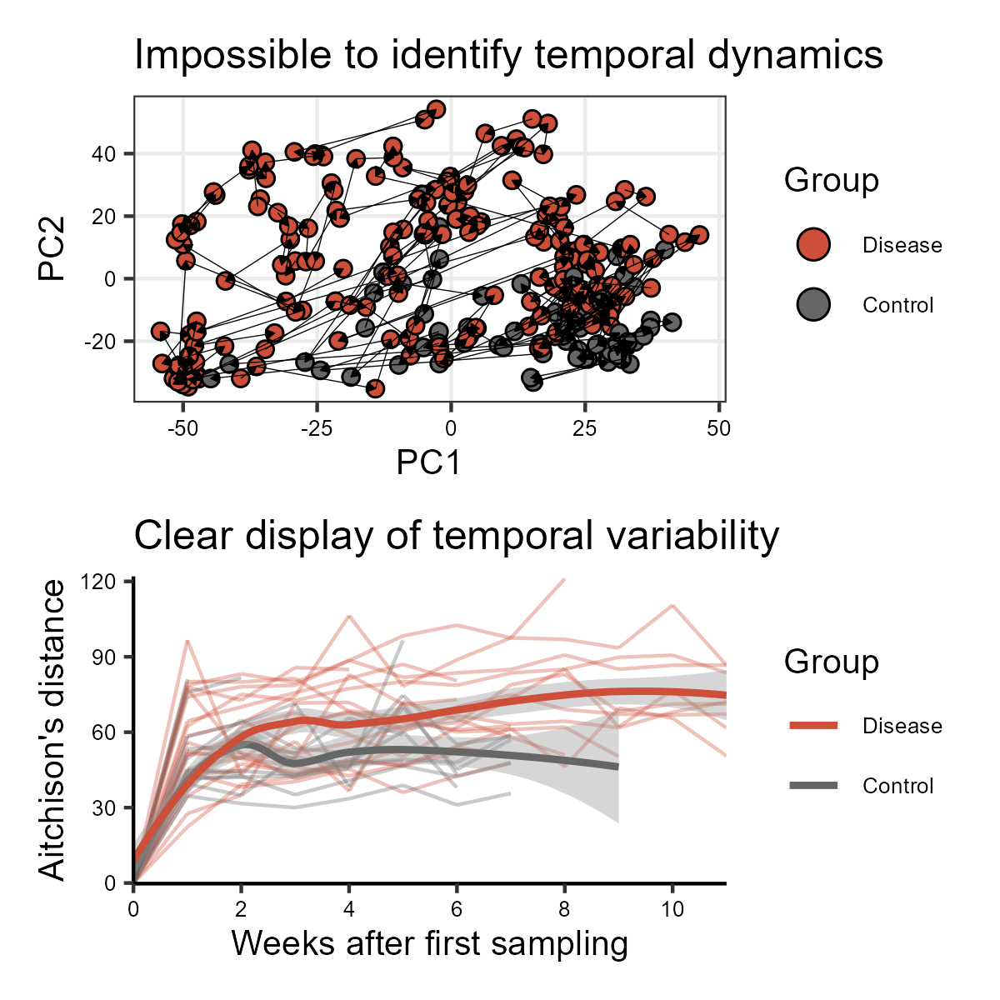

# MVP - Microbiome Visualization Project

This is an opinionated essay on good and bad practices in microbiome data visualization. Here, I'll highlight some issues I find with certain types of visualizations, while providing alternatives. I hope this exercise helps me -and hopefully others- to become **MVPs** in generating effective microbiome visualizations.

This work is inspired by [Friends Don't Let Friends Make Bad Graphs](https://github.com/cxli233/FriendsDontLetFriends/tree/main?tab=readme-ov-file), so I'll minimize overlap between repositories as much as possible.

The folder `data/` contains the raw data used in the generation of the plots below. The code to generate the figures in `.Rmd` format can be found in the `scripts/` folder, and the output files are stored in `figures/`. Note that you can see the code used to build the visualizations by clicking on them.

#### **About me**

-   Author: Benjamin Valderrama, PhD student at APC microbiome Ireland.
-   Links: [Personal Website](https://benjamin-valderrama.github.io/) \| [Google scholar](https://scholar.google.com/citations?user=fteDslYAAAAJ&hl=es) \| [BlueSky](https://bsky.app/profile/bvalderrama.bsky.social)

# Table of contents

1.  [Making sense of cluttered PCAs](https://github.com/Benjamin-Valderrama/MVP/#1-making-sense-of-cluttered-pcas)
2.  [PCAs cannot represent temporal dynamics](https://github.com/Benjamin-Valderrama/MVP/#2-PCAs-cannot-represent-temporal-dynamics)

# 1. Making sense of cluttered PCAs

The first visualization I choose to cover are Principal Component Analysis (PCA) plots, ubiquitous in the microbiome literature. They are a simplified 2D representation of the multiple differences between samples. Thus, higher distances between any pair of samples represent higher dissimilarity between them in the (original) multidimensional space.

It's easy to see than when dealing with many samples, PCA plots are very cluttered making it impossible to determine differences between the study groups (shown in different colors). One solution is to add boxplots (or density plots) alongside the principal components to illustrate the distribution of each group. This approach is fairly common in the literature and is often enough

A less common alternative (although effective) is to bin the PCA space, plot all distributions and background and build plots to highlight the distribution of each group, as shown in the three plots on the bottom. However, when working with more than three groups, this approach may lose effectiveness.

# 2. PCAs cannot represent temporal dynamics

Often PCA plots are used to represent changes in microbiome communities over time, however, PCA plots are a bad idea to represent such dynamics as the analysis don't acknowledge the temporal structure of the data. However, it is common to see visualizations where researchers force in the temporal dynamics by linking data using arrows. This is a bad solution as it scales poorly when more samples are included, whether due to larger overall sample sizes or additional timepoints per unit of study.

One effective alternative I to compute dissimilarities (or distances) between a reference point and each of the other samples taken from the unit of study. Opposite to the PCA plot, this visualization does account for the temporal structure of our data, and makes it easy to identify the evolution of each unit over time, and the collective patterns of our groups of interest.

I've focused in temporal dynamics because it is a common sampling strategy in my field. However, these principles apply when our data is affected by other types of internal structures of continuous nature, like physical distance to a reference point, or a gradient of pH or Oxygen.

