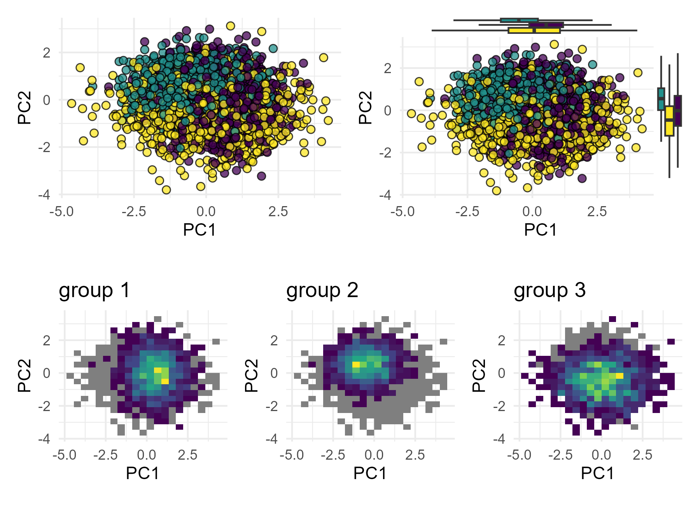

---
output:
  html_document: default
  pdf_document: default
---

# MVP - Microbiome Visualization Project

This is an opinionated essay on good and bad practices in microbiome data visualization. Here, I'll highlight some issues I find with certain types of visualizations, while providing alternatives. I hope this exercise helps me -and hopefully others- to become **MVPs** in generating effective microbiome visualizations.

This work is inspired by [Friends Don't Let Friends Make Bad Graphs](https://github.com/cxli233/FriendsDontLetFriends/tree/main?tab=readme-ov-file), so I'll minimize overlap between repositories as much as possible.

The folder `data/` contains the raw data used in the generation of the plots below. The code to generate the figures in `.Rmd` format can be found in the `scripts/` folder, and the output files are stored in `figures/`.

#### **About me**

-   Author: Benjamin Valderrama, PhD student at APC microbiome Ireland.
-   Links: [Personal Website](https://benjamin-valderrama.github.io/) \| [Google scholar](https://scholar.google.com/citations?user=fteDslYAAAAJ&hl=es) \| [BlueSky](https://bsky.app/profile/bvalderrama.bsky.social)

# Table of contents

1.  [Making sense of cluttered PCAs](https://github.com/Benjamin-Valderrama/MVP/#1-making-sense-of-cluttered-pcas)

# 1. Making sense of cluttered PCAs

::: {align="justify"}
The first visualization I choose to cover are Principal Component Analysis (PCA) plots, ubiquitous in the microbiome literature. They are a simplified 2D representation of the multiple differences between samples. Thus, higher distances between any pair of samples represent higher dissimilarity between them in the (original) multidimensional space.

It's easy to see than when dealing with many samples, PCA plots are very cluttered making it impossible to determine differences between the study groups (shown in different colors). One solution is to add boxplots (or density plots) alongside the principal components to illustrate the distribution of each group. This approach is fairly common in the literature and is often enough

A less common alternative (although effective) is to make bins on the PCA space and to build multiple plots with density distributions for each group, as shown in the three plots on the bottom. However, when working with more than 3 groups this alternative might loose effectiveness.
:::

